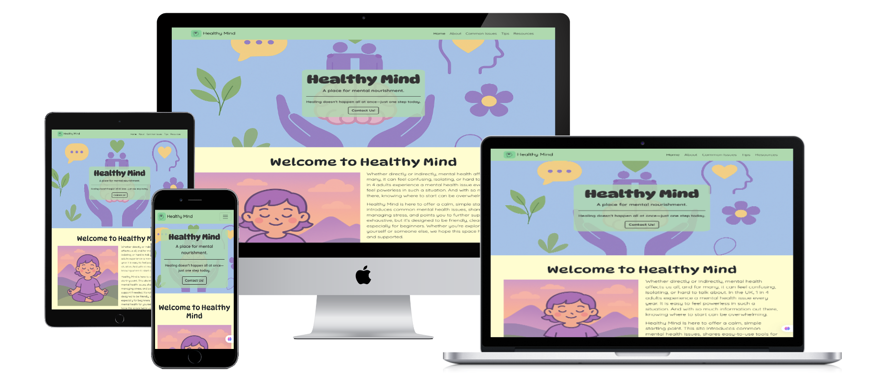
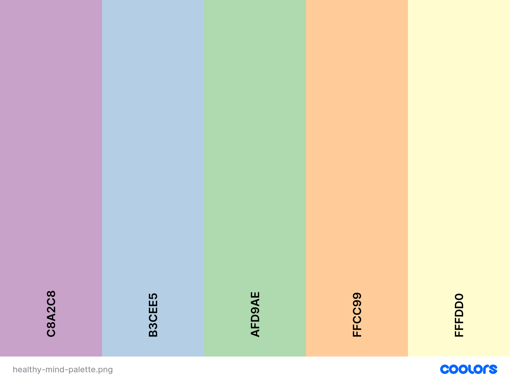
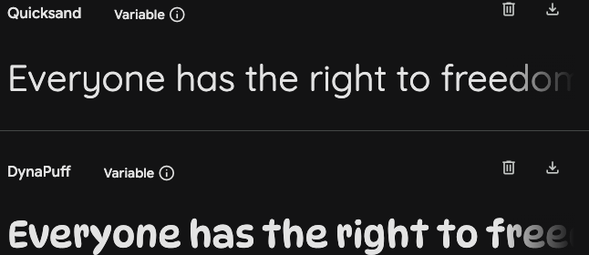
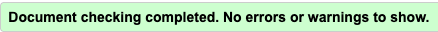

# Individual Formative Assignment 1

## Healthy Mind | Mental Health Awareness



**Author:** James Jarvis-Bicknell

**This project was developed as part of my 16-week full-stack development bootcamp with Code Institute. It brings together what we have learned from the front-end side of the course: HTML and CSS essentials + Bootstrap.**

## Design Choices:

### Colours: 

For my colour palette, I took inspiration from [pinterest](https://uk.pinterest.com/pin/823947694363170020/). For this website I wanted to evoke an inviting sense of warmth and calm as well as creating a playful, light-hearted and accessible feel. This selection tries to balance these two goals by using vibrant colours softened through pastel tones. 



### Typography: 

The following fonts were selected from [Google Fonts](https://fonts.google.com/) to further support the balance between calm / accessible and playful / light. Quicksand was chosen as the main typeface for its readability, accessibility and gentleness. Dynapuff was chosen for the major headings to inject a sense of playfulness into the site and balance out the potentially heavy subject-matter. 



### Images and Icons:

Wherever icons were used in this project (resources section and footer), they were taken from [Font Awesome](https://fontawesome.com/).

All images in this project were AI generated using [Microsoft Copilot](https://copilot.microsoft.com/chats/mpxbm6uP1PJA8vUpBgf1Y). This was used for several reasons: 
1. Avoid any possible copyright issues.
2. The colour palette was chosen before images. Therefore, using AI made it more straightforward to find images coherent with the colour scheme.
3. I did not want photorealistic images and feeding AI prompts enabled image-generation in keeping with the playful feel I was aiming for.

## Wireframes:

The basic structure of Healthy Mind was worked out using the wireframe software [BALSAMIQ](https://balsamiq.com/?gad_source=1&gad_campaignid=203404003&gbraid=0AAAAAD3BuzMO_b68z_FDD6MbtQx7bQ_6V&gclid=CjwKCAjwruXBBhArEiwACBRtHYXoWEdqjT_KJt9p8mXI8IdiipWikWrlgDIK9-gS3FKGd6jtQpN4qxoCpiQQAvD_BwE), to guide my development choices when coding. Over the project the vision for the layout changed and new sections were incorporated. An updated set of wireframes were created to reflect this. I have included both the original wireframes and the updated wireframes for comparison. 

### Desktop: 

- [Wireframe 1: Hero, About, Common Issues](assets/readme-documentation/updated-wireframes/desktopwireframe1.png)
- [Wireframe 2: Tips, Resources](assets/readme-documentation/updated-wireframes/desktopwireframe2.png)
    - [~~Initial Wireframe~~](assets/readme-documentation/initial-wireframe/desktop-initial-wireframe.png)

### Tablet:

- [Wireframe 1: Hero, About, Common Issues](assets/readme-documentation/updated-wireframes/tabletwireframe1.png)
- [Wireframe 2: Tips, Resources](assets/readme-documentation/updated-wireframes/tabletwireframe2.png)
    - [~~Initial Wireframe~~](assets/readme-documentation/initial-wireframe/tablet-initial-wireframe.png)

### Mobile: 

- [Wireframe 1: Home, About, Common Issues](assets/readme-documentation/updated-wireframes/mobilewireframe1.png)
- [Wireframe 2: Tips, Resources, Contact](assets/readme-documentation/updated-wireframes/mobilewireframe2.png)
    - [~~Initial Wireframe~~](assets/readme-documentation/initial-wireframe/mobile-initial-wireframe.png)

## Technologies: 

### Languages: 

- [HTML](https://en.wikipedia.org/wiki/HTML5)
- [CSS](https://en.wikipedia.org/wiki/CSS) 
- [Markdown](https://en.wikipedia.org/wiki/Markdown)

### Other Technologies, Frameworks & Libraries: 

- [Bootstrap 5](https://en.wikipedia.org/wiki/Bootstrap_(front-end_framework))
- [Google Fonts](https://fonts.google.com/)
- [Font Awesome](https://fontawesome.com/)
- [Visual Studio Code](https://code.visualstudio.com/)
- [Git](https://git-scm.com/)
- [GitHub](https://github.com/)
- [BALSAMIQ](https://balsamiq.com/?gad_source=1&gad_campaignid=203404003&gbraid=0AAAAAD3BuzMO_b68z_FDD6MbtQx7bQ_6V&gclid=CjwKCAjwruXBBhArEiwACBRtHYXoWEdqjT_KJt9p8mXI8IdiipWikWrlgDIK9-gS3FKGd6jtQpN4qxoCpiQQAvD_BwE)
- [Coolors](https://coolors.co/)
- [Pinterest](https://uk.pinterest.com/)
- [Stack Overflow](https://try.stackoverflow.co/get-teams/?utm_source=adwords&utm_medium=ppc&utm_campaign=kb_teams_search_brand_emea-dach&_bt=657236278306&_bk=stack+overflow&_bm=p&_bn=g&gad_source=1&gad_campaignid=10618329760&gbraid=0AAAAADlO0L1YSj_Ax7ln3HiA8-oM9nEWP&gclid=CjwKCAjwruXBBhArEiwACBRtHc83drtdIp0m7bMM_Ic-Al4NFRQfCG4HOKmsIk1dWiAjrPGmGlD3UxoCNCcQAvD_BwE)

## Testing

For testing, I made use of multiple resources: HTML and CSS validators, Chrome Dev Tools Lighthouse tests, thorough user testing, and WAVE accessibility evaluation tools. Errors and bugs found during the testing stage will be noted in the Bugs and Fixes section.

### Tests

[HTML Validator](https://validator.w3.org/)

All HTML pages have been tested with the w3c validator and passed with no errors. 



[Jigsaw CSS Validator](https://jigsaw.w3.org/css-validator/)

Stylesheet has been passed through the CSS validator and passed with no errors. 


[Chrome Dev Tools - Lighthouse](https://developer.chrome.com/docs/lighthouse/overview/)

When running lighhouse tests, I used an incognito window to avoid any possible interference in the results from my Chrome extensions. 

- index.html 
    - Desktop
        - [Lighhouse test 1](assets/readme-documentation/lighthouse-report1.png) 
        - [Lighthouse test 2](assets/readme-documentation/lighthouse-report2.png)
        - Originally the performance  and accessibility scores were lower than ideal. 
        
        To address performance, Lighthouse recommended reformatting images into 'next-gen' formats (e.g. webP or AVIF) and properly sizing images. Images were resized using an [image resizer tool](https://www.img2go.com/resize-image) and were converted to webP using an [image converter tool](https://cloudinary.com/tools/png-to-webp). This resolved the performance issues.
        
        To address accessibility, Lighthouse highlighted that the buttons didn't have accessible names and the heading elements were not sequentially-descending. Unnecessary buttons were removed from the page, the page was scanned with co-pilot for accessibility improvements (and aria-labels were added), and the ```<h4>``` element in the footer was replaced with a ```<p>```element styled as a header. This resolved the accessibility issues. 